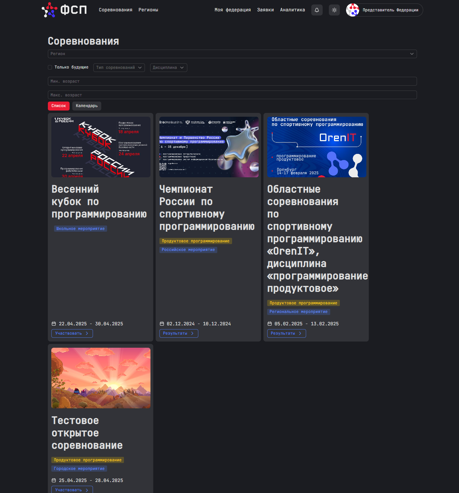
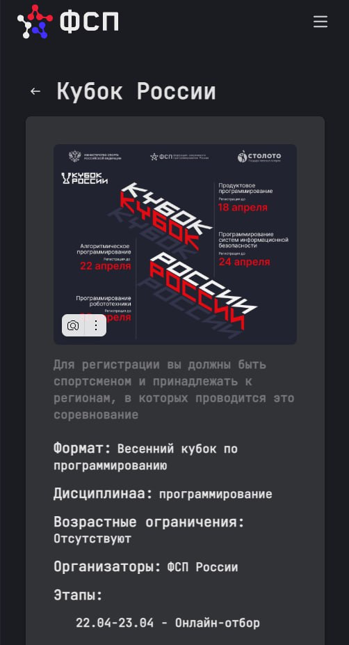
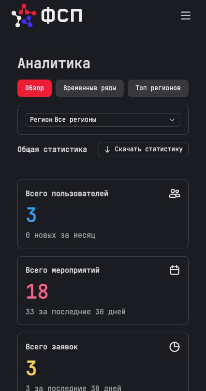
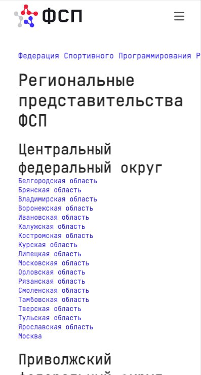
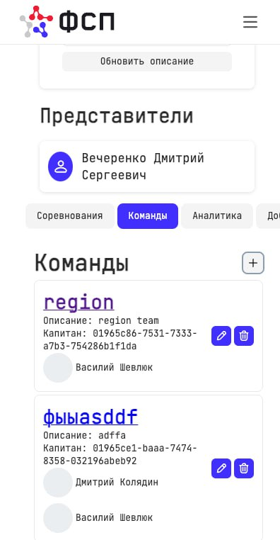
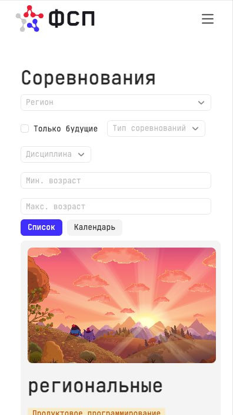

# Автоматизированная информационная система «Федерация Спортивного Программирования»

> [!Warning] Внимание!
> Вы можете ознакомится с подробной документацией проекта по [ссылке](https://fsp-platform.ru/docs).
>
> [Архитектура и функционал](https://fsp-platform.ru/docs/backend_index_.html)
>
> [Структура данных](https://fsp-platform.ru/docs/data.html)
>
> [Наш сайт](https://fsp-platform.ru)

## Описание проекта

Система предназначена для автоматизации взаимодействия между Всероссийской Федерацией Спортивного Программирования (ФСП), её региональными представительствами и **спортсменами**. Платформа позволяет:

- Публиковать и управлять календарём соревнований по пяти дисциплинам  
- Принимать и модерать заявки (индивидуальные и командные)  
- Формировать и управлять составами команд  
- Вводить и публиковать результаты, автоматически обновлять портфолио спортсменов  
- Генерировать отчёты, строить дашборды и экспортировать данные  
- Отправлять уведомления (e-mail, Telegram)

---

## **О мероприятии**


Данный проект был разработан в рамках соревнования **«Кубок России по продуктовому программированию»**.  

- **Дисциплина**: Программирование продуктовое  
- **Команда**: davg  
- **Даты проведения**: 21.04—28.04  

---

## **Описание проекта**

### Проблема

Процессы в спортивном программировании во многом до сих пор организованы вручную:  
— заявки оформляются вручную и проверяются по e-mail,  
— соревнования публикуются в разрозненных источниках,  
— управление командами и сбор данных о результатах отнимает много времени,  
— у ФСП нет единого аналитического инструмента по регионам и дисциплинам.

### Цель проекта

Создать цифровую платформу, которая:

- упрощает процесс подачи и обработки заявок,
- позволяет формировать и управлять командами онлайн,
- автоматизирует публикацию и подведение итогов соревнований,
- формирует персональное портфолио спортсмена на основе достижений,
- обеспечивает ФСП доступ к агрегированной аналитике.

### Основной функционал

- Публикация и фильтрация соревнований по дисциплинам, регионам, формату и дате  
- Индивидуальная и командная регистрация на соревнования  
- Создание команд, управление участниками, система приглашений  
- Модерация заявок региональными представителями и ФСП  
- Ведение календаря мероприятий с учётом форматов: открытые, региональные, федеральные  
- Поддержка дисциплин: продуктовое, алгоритмическое, по ИБ, робототехнике и БПЛА  
- Ввод и автоматическая публикация результатов соревнований  
- Автоматическое обновление портфолио участников  
- Просмотр достижений и истории участия в соревнованиях  
- Панель аналитики для региональных представителей и ФСП с возможностью выгрузки отчётов  
- Рассылка уведомлений о приглашениях, заявках, результатах (e-mail, Telegram)  
- Публичный доступ к ленте соревнований и результатам без регистрации  
- Адаптивный дизайн для мобильных и десктопных устройств

---

## Архитектура решения

Микросервисная платформа с API Gateway и распределённым хранилищем данных. Каждая служба выполняет свою зону ответственности, что упрощает поддержку и масштабирование.

### Основные микросервисы

| Сервис                   | Назначение                                                                 |
|--------------------------|------------------------------------------------------------------------------|
| **users-service**        | Аутентификация/авторизация (JWT/OAuth), управление профилями и ролями        |
| **organizations**        | Справочник ФСП и региональных представительств                              |
| **events**               | CRUD соревнований, фильтрация, публикация                                    |
| **applications-service** | Приём, авто-валидация и модерация заявок (индивидуальных и командных)        |
| **teams**                | Формирование команд    |
| **reports**              | Хранение результатов соревнований                                  |
| **analytics**            | Сбор метрик, построение дашбордов, экспорт отчётов                           |
| **files-service**        | Хранение и доставка файлов (аватары, протоколы и т.д.)                |
| **api-gateway**          | Единая точка входа, проверка JWT, маршрутизация, rate-limit, CORS, OpenAPI  |

---

## **Логика работы системы**

1. Представитель ФСП или региона создаёт мероприятие.  
2. Спортсмены просматривают список событий и подают заявки — индивидуально или через команду.  
3. Капитаны формируют составы, приглашают участников, подают заявки.  
4. Региональные представители или ФСП проводят модерацию и утверждают участников.  
5. После проведения соревнования организаторы вводят результаты.  
6. Система публикует итоги, обновляет портфолио участников и отправляет уведомления.  
7. ФСП или регионы просматривают статистику, строят отчёты и выгружают данные при необходимости.

---

## **Состав команды**

- **Юматов Алексей** |
  **Роль**: Капитан, бэкенд  
  [Telegram](https://t.me/monikre)  

- **Касилов Глеб** |
  **Роль**: Бэкенд  
  [Telegram](https://t.me/helebka)  

- **Колядин Дмитрий** |
  **Роль**: Бэкенд  
  [Telegram](https://t.me/DeveloperDK)  

- **Старикова Варвара** |
  **Роль**: Дизайн  
  [Telegram](https://t.me/vaalkot)  

- **Шевлюк Василий** |
  **Роль**: Фронтенд  
  [Telegram](https://t.me/jlyou)  
  
---

## **Демонстрация**

- Ознакомьтесь с проектом на [сайте](https://fsp-platform.ru/).
- **Документация проекта**: [ссылка](https://fsp-platform.ru/docs).

---

## Как получить и использовать роли

### Роли

- **Администратор** — назначает представителей федерации  
- **Представитель ФСП** — создаёт федеральные соревнования, утверждает заявки от регионов  
- **Руководитель регионального представительства** — управляет событиями в своём регионе  
- **Региональный представитель** — подаёт заявки, модерирует, работает с аналитикой  
- **Спортсмен** — участвует в соревнованиях, вступает в команды, получает результаты  

### Назначение ролей

1. При регистрации выберите тип аккаунта  
2. Ваш запрос попадёт вышестоящему пользователю  
3. После одобрения вы получите уведомление и соответствующий доступ

Для тестирования можно использовать ссылку с доступом администратора (открыть в режиме инкогнито):

# **Дополнительная информация**

Вы можете зайти под аккаунтом администратора, используя эту ссылку (Рекомендуется открыть в режиме инкогнито):

```url
https://fsp-platform.ru/api/get/root
```

Аккаунт регионального представителя:

```url
https://fsp-platform.ru/api/get/fsp_region_head
```

Аккаунт спортсмена:

```url
https://fsp-platform.ru/api/get/sportsman
```

---

## **Лицензия**

Этот проект лицензирован на условиях [лицензии](LICENSE.md).

---

## **Немного скринов интерфеса**


.png>)
.png>)
.png>)
.png>)
.png>)
.png>)
.png>)
.png>)


## **Немного скринов мобильного интерфеса**





